#  Aquí y Ahora Pilates

Aplicación web de administración para un estudio de Pilates ("Aquí y Ahora"), pensada para uso exclusivo de la dueña/administradora del estudio. Permite gestionar el día a día del negocio: alumnos, planes, horarios fijos, turnos puntuales, cancelaciones, recuperos de clase y visitas de prueba.


##  Demo

**Aplicación:** https://turnos-pilates.netlify.app/

**Credenciales de prueba:**
> 📧 Email: admin@pilates.com  
> 🔑 Contraseña: admin1234


##  Tecnologías utilizadas

### Frontend
- React 18
- Vite
- React Router
- CSS Modules

### Backend / BaaS
- Supabase
  - PostgreSQL
  - Authentication


##  Uso de Inteligencia Artificial

Durante el desarrollo se utilizó **Claude (Anthropic)** como asistente de programación.

Se empleó para:

- Diseño del modelo de datos
- Generación de componentes iniciales
- Implementación de lógica de negocio
- Revisión de bugs y refactorización
- Mejora de UI/UX
- Consistencia de estilos

Todas las sugerencias fueron revisadas, adaptadas y validadas manualmente antes de ser incorporadas al proyecto.

##  Seguridad

El sistema implementa seguridad en múltiples capas:

- Supabase Authentication para gestión de usuarios
- Protected Routes en el frontend
- **Row Level Security (RLS)** en todas las tablas

Las políticas de RLS aseguran que ninguna operación pueda ejecutarse sin un usuario autenticado, evitando el acceso directo a la base de datos mediante la `anon key`.

##  Funcionalidades

###  Autenticación
- Login con email y contraseña (Supabase Auth)
- Protección de rutas (Protected Routes)
- Persistencia de sesión
- **Row Level Security (RLS)** habilitado en todas las tablas


###  Gestión de alumnos
- Alta, baja y reactivación de alumnos
- Búsqueda dinámica
- Asignación de planes
- Horarios fijos por alumno


###  Agenda semanal
- Vista semanal completa de clases
- Cupos en tiempo real
- Navegación por fechas


###  Gestión de clases
- Listado de alumnos por clase
- Cancelaciones
- Asignación de recuperos
- Registro de visitas de prueba
- Asistencia


###  Reprogramación
- Cambio de horario fijo de alumnos
- Validación previa de disponibilidad real

###  Feriados
- Bloqueo de fechas completas


##  Arquitectura

El proyecto está organizado en capas para separar UI, lógica de negocio y acceso a datos.

```text
src
│
├── components/   # Componentes reutilizables (Header, Footer, Layout, Modales).
├── context/      # AuthContext — sesión global compartida.
├── config/       # Cliente Supabase.
├── pages/        # Vistas principales.
├── services/     # Lógica de acceso a Supabase.
├── utils/        # Funciones utilitarias (fechas, cálculo de cupos).
└── assets/       # Imágenes.
```

Toda la comunicación con la base de datos se centraliza en `services/`, manteniendo los componentes enfocados únicamente en la UI. La verificación de sesión vive en `context/AuthContext` y se comparte con toda la app sin repetir llamadas a Supabase en cada ruta.

##  Modelo de datos

| Tabla        | Descripción |
|-------------|-------------|
| clientes     | Información de alumnos |
| planes       | Planes disponibles |
| clase        | Horarios fijos del estudio |
| inscripcion  | Relación alumno ↔ clase |
| reserva      | Cancelaciones, recuperos, asistencia, pruebas |
| feriado      | Días sin actividad |

Se separan **inscripciones permanentes** y **reservas puntuales** para evitar duplicación de registros y simplificar la lógica de recuperos y cancelaciones.


##  Instalación

### Requisitos
- Node.js 18+
- npm
- Proyecto en Supabase

### 1. Clonar el repositorio
```bash
git clone <URL_DEL_REPOSITORIO>
cd pilates-app
```

### 2. Instalar dependencias
```bash
npm install
```

### 3. Variables de entorno
Crear un archivo `.env`:

```env
VITE_SUPABASE_URL=TU_SUPABASE_URL
VITE_SUPABASE_ANON_KEY=TU_SUPABASE_ANON_KEY
```

### 4. Base de datos
Ejecutar el script:

```
database/schema.sql
```

en el SQL Editor de Supabase.

### 5. Ejecutar en desarrollo
```bash
npm run dev
```

Abrir:
```
http://localhost:5173
```

##  Build

```bash
npm run build
```


##  Capturas

### Login
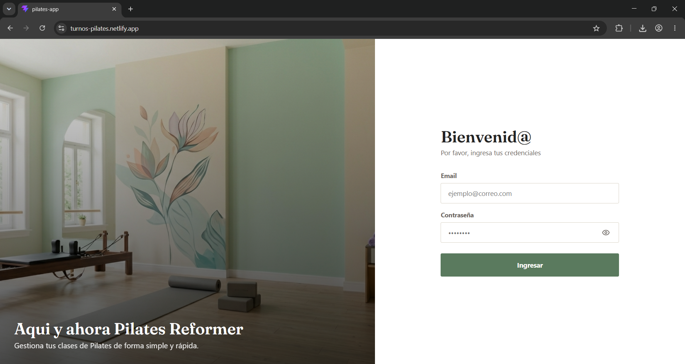

### Home
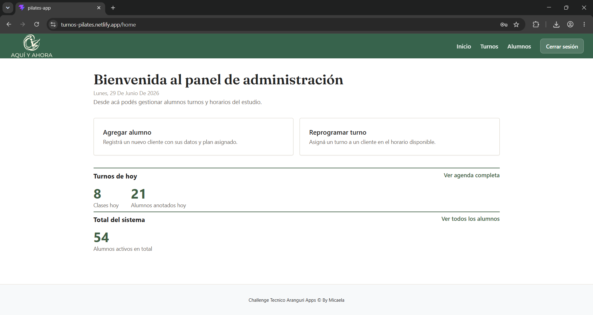


### Agenda semanal
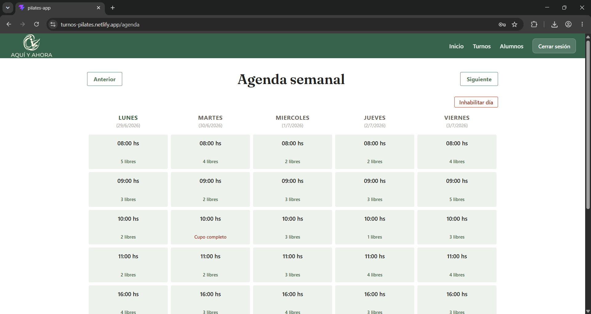

### Detalle de una clase
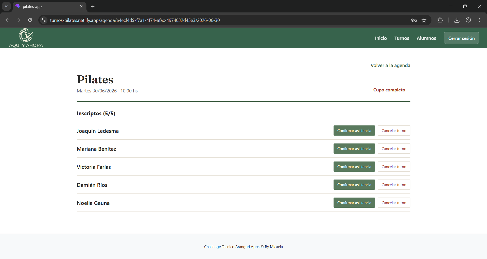


### Agregar Alumno
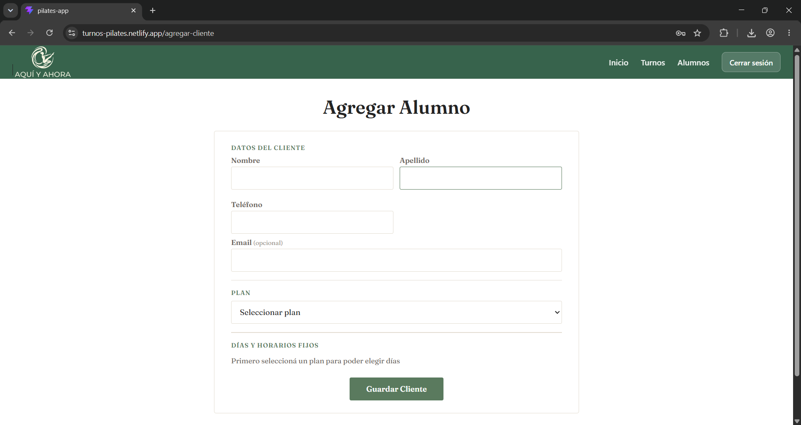

### Listado de alumnos
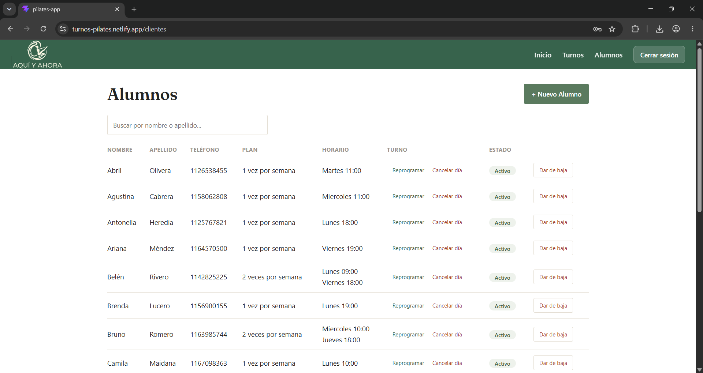


---

## Mobile

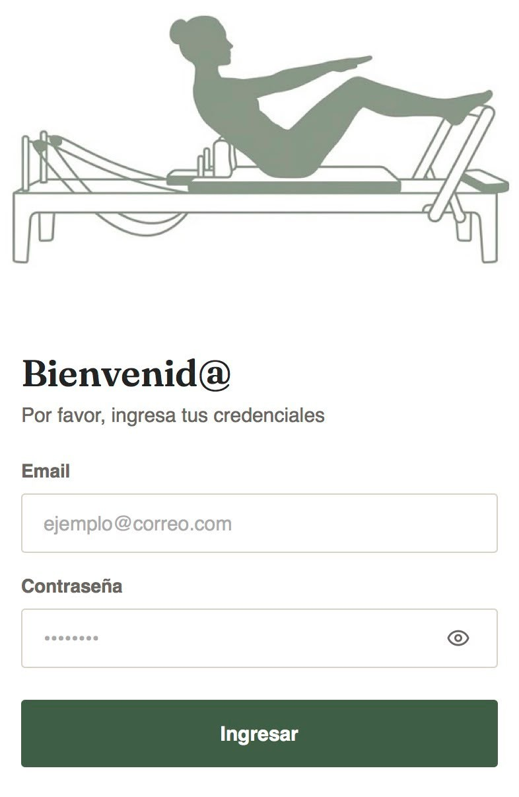
<br/>
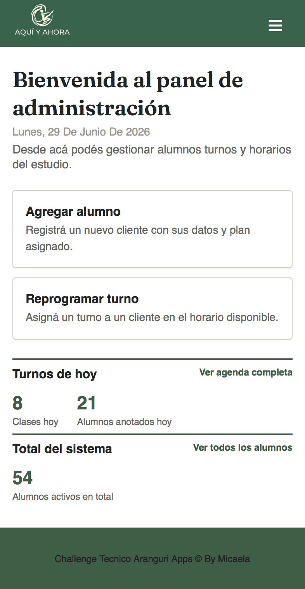
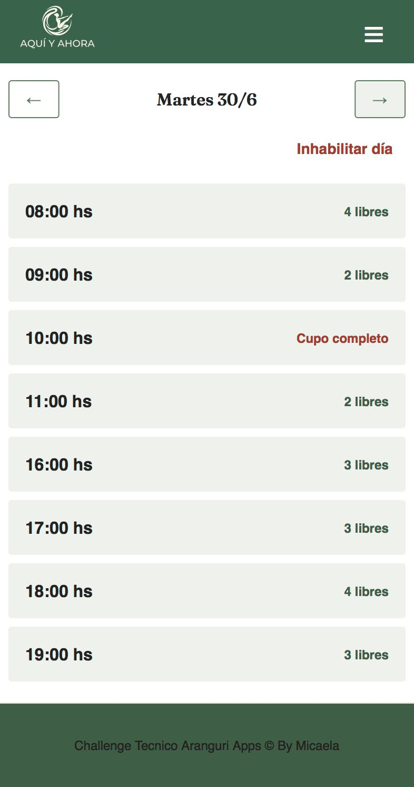
<br/>
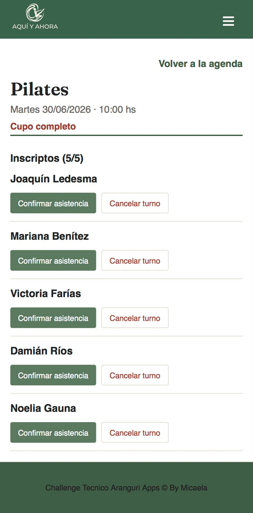
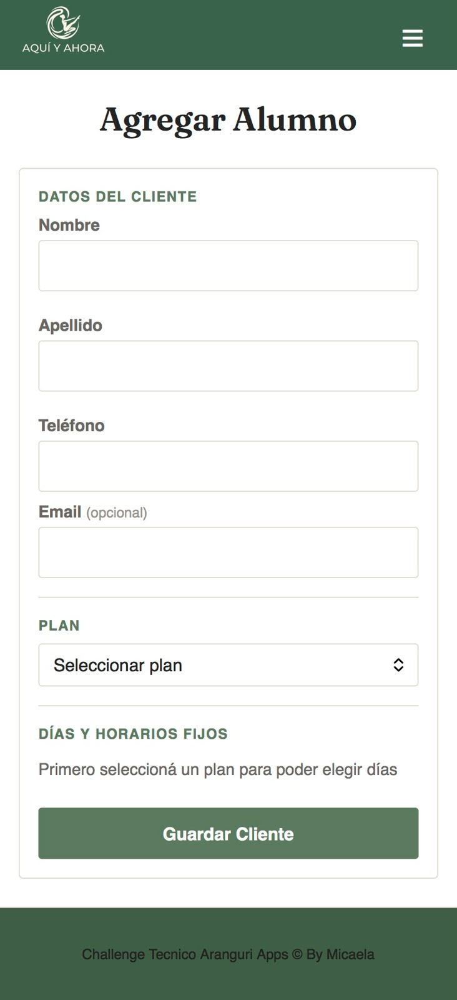
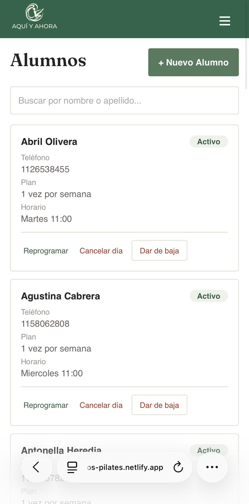